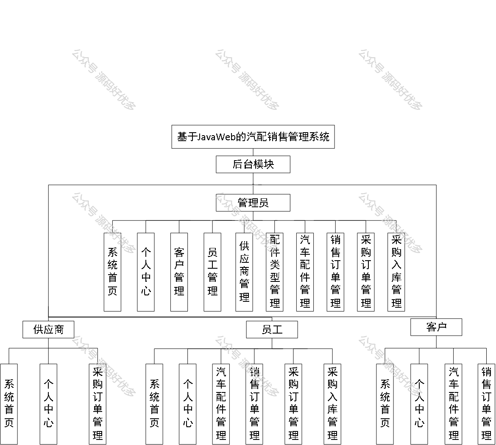
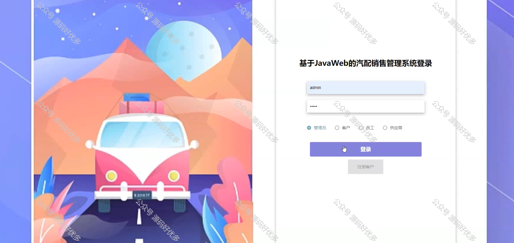
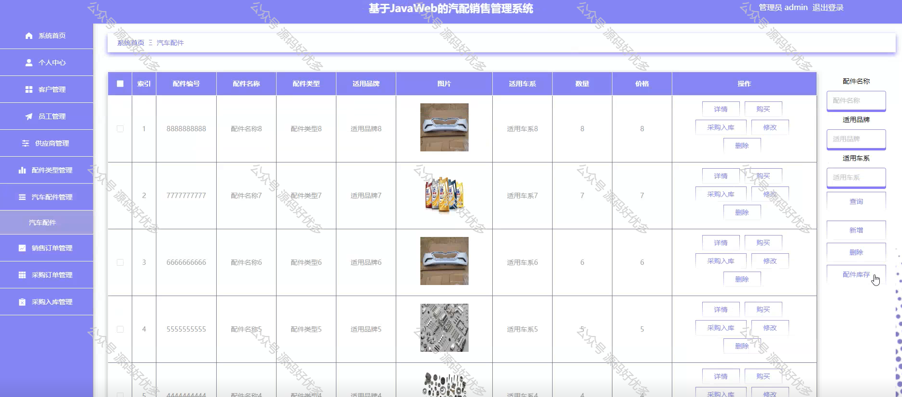
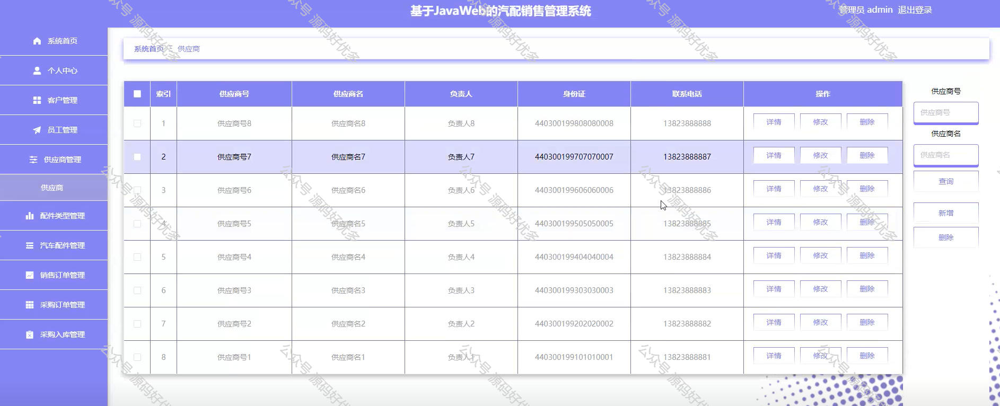
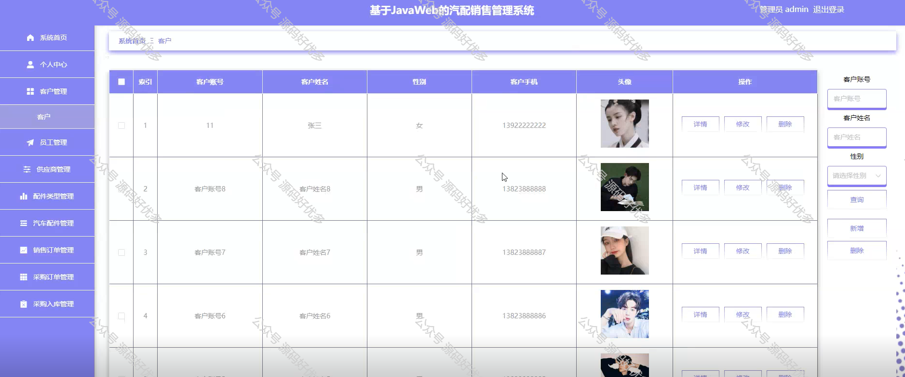
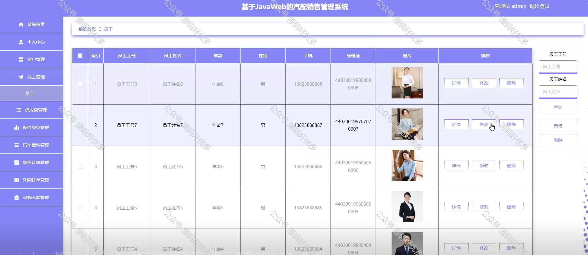
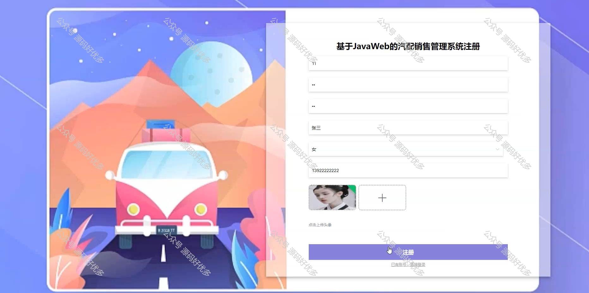
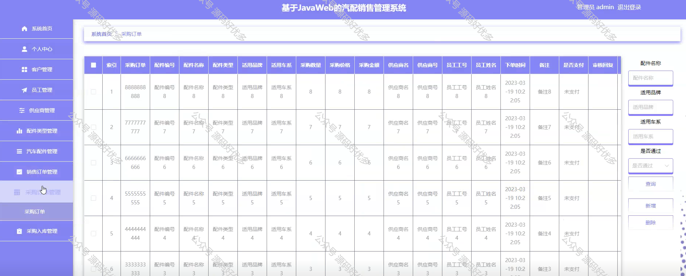
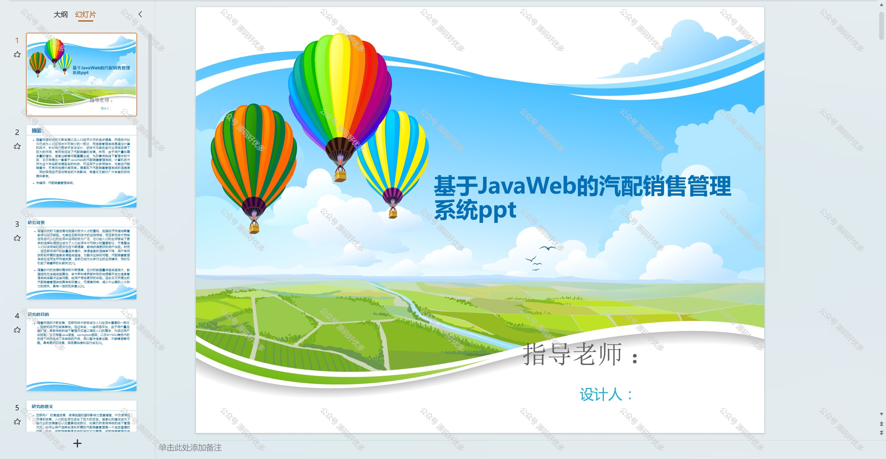
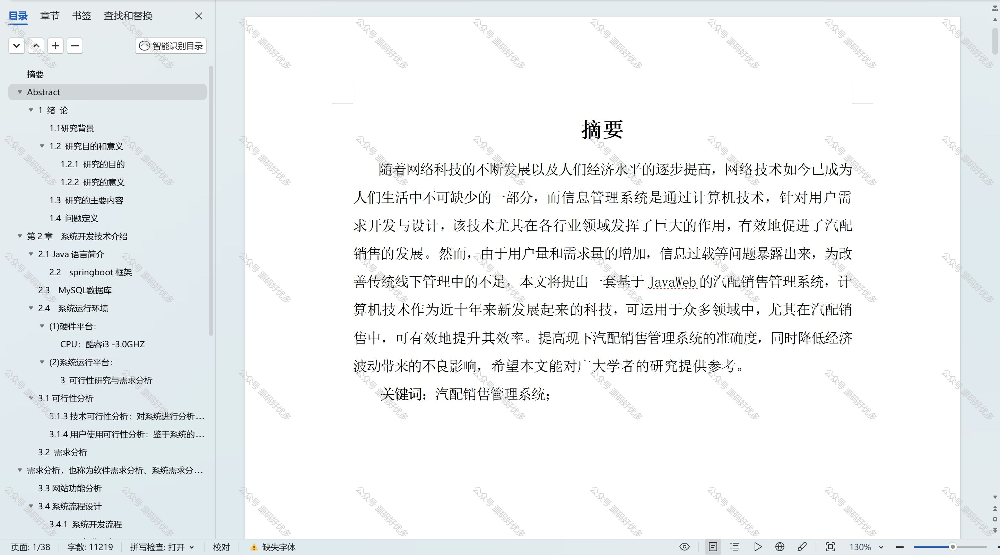

 
## 查看主页获取源码

### 一、作品包含

源码+数据库+设计文档万字+PPT+全套环境和工具资源+部署教程

### 二、项目技术

前端技术：Html、Css、Js、Vue、Element-ui

数据库：MySQL

后端技术：Java、Spring Boot、MyBatis

  

### 三、运行环境

开发工具：IDEA/eclipse

数据库：MySQL5.7

数据库管理工具：Navicat10以上版本

环境配置软件： JDK1.8+Maven3.6.3

前端Nodejs：14

### 四、项目介绍
项目编号：springbootA226

在汽车配件市场日益扩大的背景下，汽配销售管理系统成为了行业内部优化运营流程、提升服务质量的必然选择。该系统通过信息化手段，为汽配销售商提供了一个统一的操作平台，以更好地应对市场竞争和客户需求的多样性，从而在提升企业竞争力的同时，也为整个汽车配件行业的发展注入了新的动力。

系统分为管理员、供应商、员工、客户
管理员的功能：系统首页、个人中心、客户管理、员工管理、供应商管理、配件类型管理、汽车配件管理、销售订单管理、采购订单管理和采购入库管理。
供应商的功能：系统首页、个人中心、采购订单管理。
员工的功能：系统首页、个人中心、汽车配件管理、销售订单管理、采购订单管理、采购入库管理。
客户的功能：系统首页、个人中心、汽车配件管理、销售订单管理。

### 五、运行截图

  
